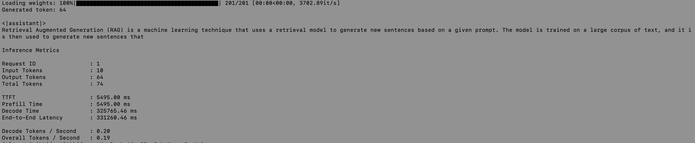
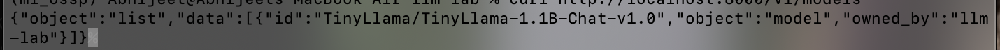
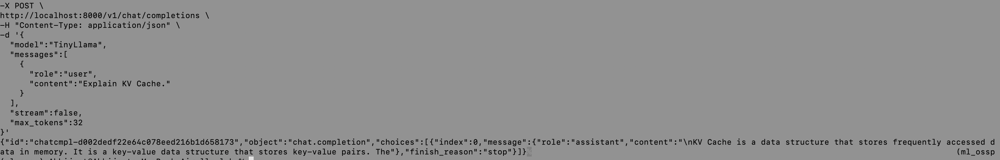
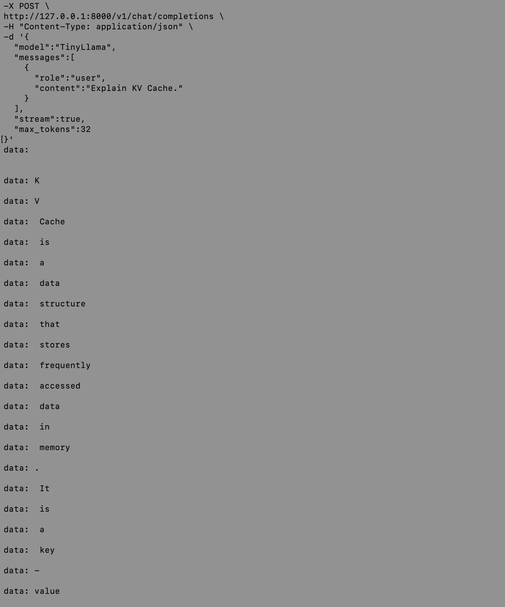
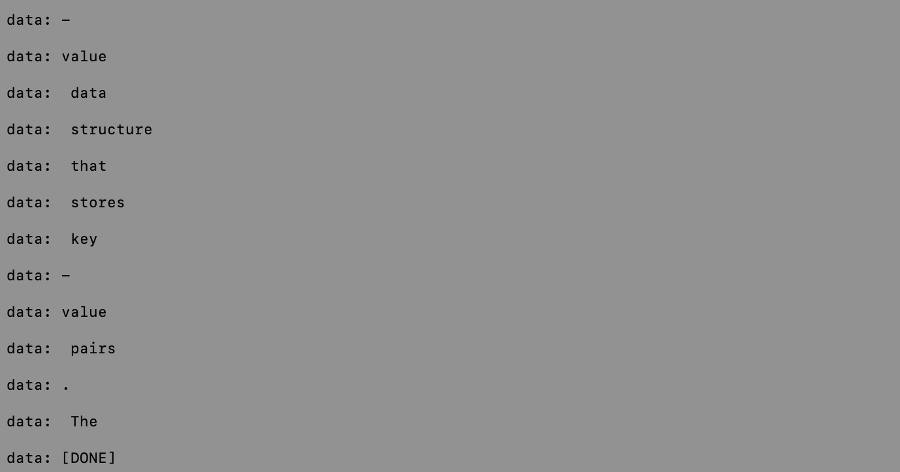

I don't know what am I doing but its good, yk, take a look

# llm-lab

A part of comprehensive lab work for getting into depths of modern Large Language Models and how are they trained, evaluated, served, and deployed.

Core internals behind production LLM systems instead of treating them as black boxes.

                                    llm-lab

                         ┌─────────────────────────┐
                         │        Datasets         │
                         └────────────┬────────────┘
                                      │
                                      ▼
                         ┌─────────────────────────┐
                         │    Training Pipeline    │
                         │  • LoRA                 │
                         │  • QLoRA                │
                         │  • SFT                  │
                         └────────────┬────────────┘
                                      │
                                      ▼
                         ┌─────────────────────────┐
                         │ Evaluation Pipeline     │
                         │ • Benchmarks            │
                         │ • LLM-as-a-Judge        │
                         │ • Pairwise Evaluation   │
                         │ • Failure Analysis      │
                         └────────────┬────────────┘
                                      │
                                      ▼
                         ┌─────────────────────────┐
                         │    Inference Engine     │
                         │ • Scheduler             │
                         │ • KV Cache              │
                         │ • Static Batching       │
                         │ • Sampling              │
                         └────────────┬────────────┘
                                      │
                                      ▼
                         ┌─────────────────────────┐
                         │      Serving Layer      │
                         │ • FastAPI               │
                         │ • SSE Streaming         │
                         │ • OpenAI API            │
                         │ • Metrics               │
                         └────────────┬────────────┘
                                      │
                                      ▼
                         ┌─────────────────────────┐
                         │      Deployment         │
                         │ • Docker                │
                         │ • Docker Compose        │
                         └─────────────────────────┘
---

## Features

### Training
- Transformer inspection
- LoRA
- QLoRA
- Adapter merging
- Supervised Fine-tuning (SFT)

### Evaluation
- Reference-based evaluation
- LLM-as-a-Judge
- Pairwise evaluation
- Lexical metrics
- Benchmark datasets
- Failure analysis


### Inference
- Autoregressive generation
- KV Cache
- Quantization
- Static batching
- Scheduler
- Generation state management

### Serving
- FastAPI inference server
- Server-Sent Events (SSE) streaming
- OpenAI-compatible Chat Completions API
- Health endpoint
- Model metadata endpoint
- Performance metrics
  - Time To First Token (TTFT)
  - Prefill latency
  - Decode latency
  - End-to-end latency
  - Token throughput


### Deployment
- Docker
- Docker Compose

---

## Project Structure

```text
src/
├── training/
├── evaluation/
├── inference/
│   ├── engine/
│   └── serving/
└── datasets/
```

---

## Example

### Chat Completion

```bash
curl -X POST http://localhost:8000/v1/chat/completions \
-H "Content-Type: application/json" \
-d '{
  "model":"TinyLlama",
  "messages":[
    {
      "role":"user",
      "content":"Explain KV Cache."
    }
  ]
}'
```


---
### Streaming

```bash
curl -N \
-X POST \
http://localhost:8000/v1/chat/completions \
-H "Content-Type: application/json" \
-d '{
  "model":"TinyLlama",
  "messages":[
    {
      "role":"user",
      "content":"Explain KV Cache."
    }
  ],
  "stream":true
}'
```


---

## Roadmap

- [x] LoRA
- [x] QLoRA
- [x] Evaluation Pipeline
- [x] Inference Engine
- [x] Serving
- [x] OpenAI-Compatible API
- [x] Deployment

---

## License

MIT